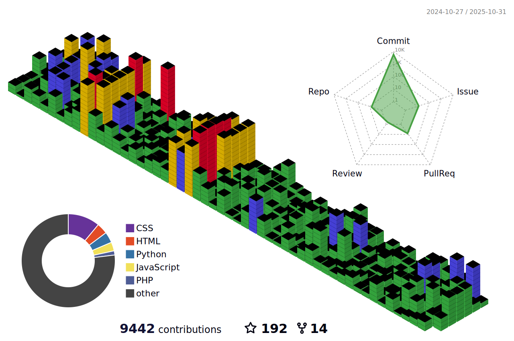

# 💫 About Me
---


🚀 Hi, I'm Gideon Bett  passionate about coding and innovation.  <br/>
🌱 Always learning and growing, embracing new challenges.  <br/>
🔥 Turning bugs 🐛 into breakthroughs 💡 and ideas into reality. <br/> 
❤️ Coding isn't just a skill—it's a lifestyle I love. <br/>
🌐 Exploring infinite possibilities in the tech world 🌌.  <br/>
💻 Focused on clean, efficient, and impactful code.  <br/>
🌟 Striving to create solutions that make a difference ✨.  <br/>
🔧 From debugging 🛠️ to deployment 🚢, I'm all in.<br/>


   <a href='https://nexusgkportfolio.netlify.app/' target="_blank"></a>
---
[](https://github.com/NexusGKSoftwares/freelancing_marketplace/actions/workflows/codeql.yml)

---


## 🌐 Socials:
[](https://discord.gg/NexusGK ) [](https://facebook.com/NexusGK ) [](https://instagram.com/NexusGK ) [](https://linkedin.com/in/NexusGK ) [](https://medium.com/@NexusGK ) [](https://tiktok.com/@NexusGK ) [](https://x.com/NexusGK ) [](https://codepen.io/NexusGK ) 
<h2 font-weight="bold">𝐒𝐤𝐢𝐥𝐥s</h2>
<!--  -->
<table align="center">
  <tr>
    <td align="center" width="90">
      
      <br>React
    </td>
    <td align="center" width="90">
      
      <br>Redux
    </td>
    <td align="center" width="90">
      
      <br>Next.js
    </td>
    <td align="center" width="90">
      
      <br>Gatsby
    </td>
    <td align="center" width="90">
      
      <br>Vue
    </td>
    <td align="center" width="90">
      
      <br>Nuxt.js
    </td>
    <td align="center" width="90">
      
      <br>Angular
    </td>
    <td align="center" width="90">
      
      <br>Nest.js
    </td>
    <td align="center" width="90">
      
      <br>Node.js
    </td>
    <td align="center" width="90">
      
      <br>Express
    </td>
  </tr>
  <tr>
    <td align="center" width="90">
      
      <br>Svelte
    </td>
    <td align="center" width="90">
      
      <br>WordPress
    </td>
    <td align="center" width="90">
      
      <br>Typescript
    </td>
    <td align="center" width="90">
      
      <br>PHP
    </td>
    <td align="center" width="90">
      
      <br>Laravel
    </td>
    <td align="center" width="90">
      
      <br>Python
    </td>
    <td align="center" width="90">
      
      <br>Django
    </td>
    <td align="center" width="90">
      
      <br>Flask
    </td>
    <td align="center" width="90">
      
      <br>Ruby
    </td>
    <td align="center" width="90">
      
      <br>RestAPI
    </td>
  </tr>
  <tr>
    <td align="center" width="90">
      
      <br>D3.js
    </td>
    <td align="center" width="90">
      
      <br>MaterialUI
    </td>
    <td align="center" width="90">
      
      <br>Tailwind
    </td>
    <td align="center" width="90">
      
      <br>HTML
    </td>
    <td align="center" width="90">
      
      <br>CSS
    </td>
    <td align="center" width="90">
      
      <br>Sass
    </td>
    <td align="center" width="90">
      
      <br>Bootstrap
    </td>
    <td align="center" width="90">
      
      <br>Babel
    </td>
    <td align="center" width="90">
      
      <br>Three.js
    </td>
    <td align="center" width="90">
      
      <br>Solidity
    </td>
  </tr>
  <tr>
    <td align="center" width="90">
      
      <br>AWS
    </td>
    <td align="center" width="90">
      
      <br>MDB
    </td>
    <td align="center" width="90">
      
      <br>MySQL
    </td>
    <td align="center" width="90">
      
      <br>PostgreSQL
    </td>
    <td align="center" width="90">
      
      <br>SQLite
    </td>
    <td align="center" width="90">
      
      <br>Flutter
    </td>
    <td align="center" width="90">
      
      <br>Android
    </td>
    <td align="center" width="90">
      
      <br>Java
    </td>
    <td align="center" width="90">
      
      <br>C#
    </td>
    <td align="center" width="90">
      
      <br>C++
    </td>
  </tr>
</table>
<br/>

# 💻 Tech Stack:
                                                                     
# 📊 GitHub Stats:
  <br/>
<br/>

<br/>


## 🏆 GitHub Trophies


### ✍️ Random Dev Quote


### 🔝 Top Contributed Repo


---
[](https://visitcount.itsvg.in)

  ## 💰 You can help me by Donating
  [](https://paypal.me/zeddychepkoech15@gmail.com) 



<div align="left" >
   
```shell
         ____
        |    |
  @xxxx[{:::::::::>
       _|____|_  
        /  ee`.    
      .<     __0   
     /\ \.-.' \         …ᘛ⁐̤ᕐᐷ___X
    J  `.|`.\/ \   
    | |_.|  | | | 
     \__.'`.|-' /       
     L   /|o`--'\ 
     |  /\/\/\   \           
     J /      `.__\
     |/         /  \     
      \\      .'`.  `.     
    ____)_/\_(____`.  '/
   (___._/  \_.___) `-/
```
<div align="left" >
   
```shell
       __             ___
      // )    ___--""    "-.
 \ |,"( /`--""              `.  
  \/ o                        \     
  (   _.-.              ,'"    ;  
   |\"   /`. \  ,      /       |   
   | \  ' .'`.; |      |       \.______________________________
     _-'.'    | |--..,,,\_    \________------------""""""""""""
    '''"   _-'.'       ___"-   )
          '''"        '''----""

```
</div>

<h4 align="center">
  
```diff
+@ @ @ @ @ @ @ @ @ @ @ @ @ @ @ @ @ @ @ @ @ @ @ @ @ @ @ @+
@@       o o                                           @@
@@       | |                                           @@
@@      _L_L_                                          @@
@@   ❮\/__-__\/❯ Programming isn't about what you know @@
@@   ❮(|~o.o~|)❯  It's about what you can figure out   @@
@@   ❮/ \`-'/ \❯                                       @@
@@     _/`U'\_                                         @@
@@    ( .   . )     .----------------------------.     @@
@@   / /     \ \    | while( ! (succeed=try() ) ) |     @@
@@   \ |  ,  | /    '----------------------------'     @@
@@    \|=====|/                                        @@
@@     |_.^._|                                         @@
@@     | |"| |                                         @@
@@     ( ) ( )   Testing leads to failure              @@
@@     |_| |_|   and failure leads to understanding    @@
@@ _.-' _j L_ '-._                                     @@
@@(___.'     '.___)                                    @@
+@ @ @ @ @ @ @ @ @ @ @ @ @ @ @ @ @ @ @ @ @ @ @ @ @ @ @ @+
```
</h4>
<br>
  
<!-- Proudly created with GPRM ( https://gprm.itsvg.in ) -->
